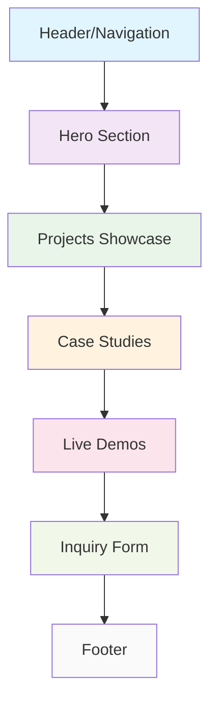
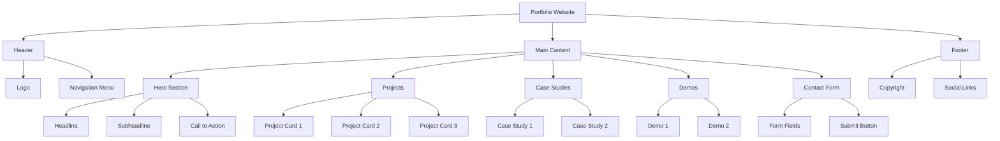

# Website Structure

## Page Layout Diagram



## Component Hierarchy



## Responsive Breakpoints

```mermaid
graph LR
    A[Mobile First] --> B[Tablet]
    B --> C[Desktop]
    
    A -->|max-width: 768px| A1[Single Column Layout]
    B -->|min-width: 769px| B1[Two Column Layout]
    C -->|min-width: 1024px| C1[Multi Column Layout]